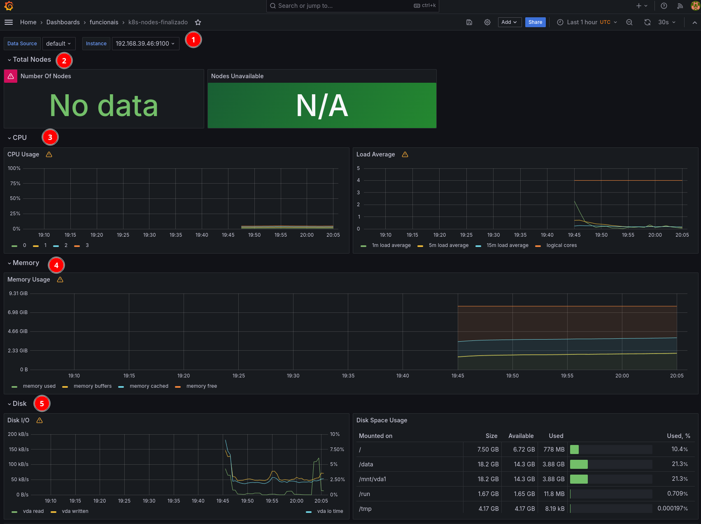
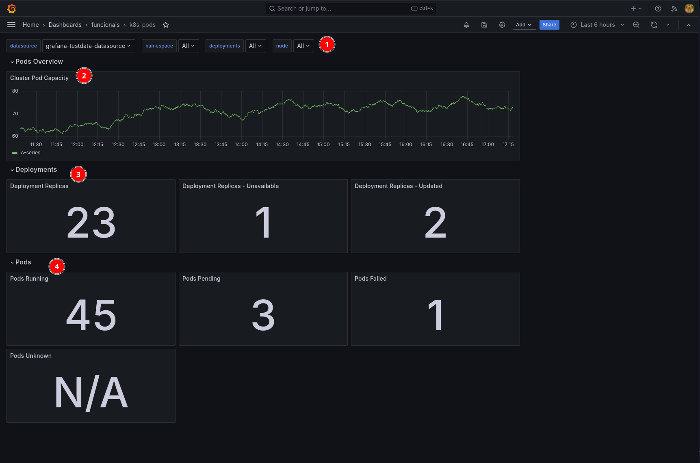
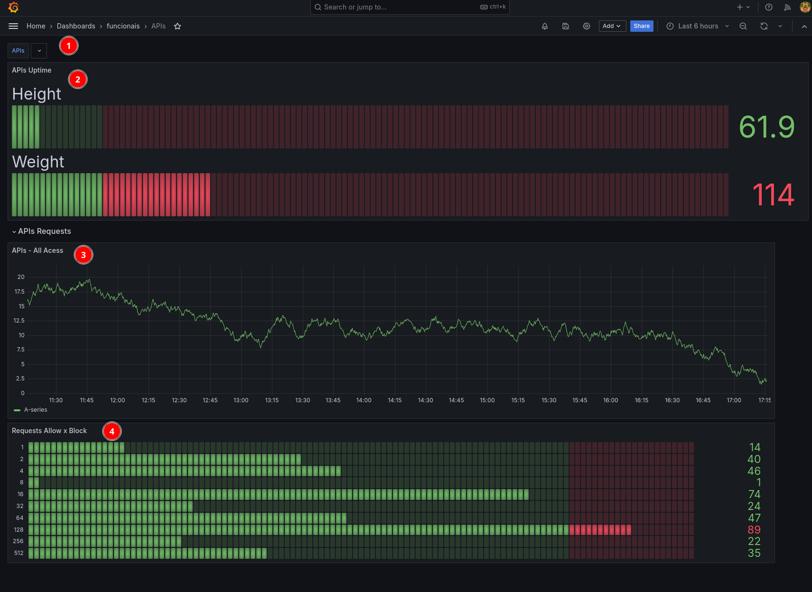
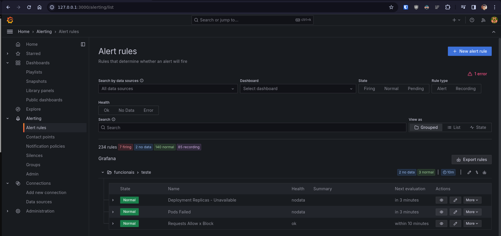

# eks-diagrama-and-grafana-dash

## Diagrama.


## Grafana Dashboard

## Instruções
- 1 - Configurar o kubernetes, ex: [https://github.com/juam-sv/aws-eks](https://github.com/juam-sv/aws-eks)
```shell
git clone https://github.com/juam-sv/eks-diagrama-and-grafana-dash.git
cd eks-diagrama-and-grafana-dash
kubectl create namespace my-grafana
kubectl apply -f grafana.yaml --namespace=my-grafana
# verifique com o seguinte comando.
kubectl get all --namespace=my-grafana
# Caso esteja rodando localmente com um minikube por exemplo faça o port-forward
kubectl port-forward service/grafana 3000:3000 --namespace=my-grafana
```
- 2 - Acess o grafana no endereço [localhost:3000](localhost:3000), logue com o usuarioe e senha admin, adicione o datasource "TestData"
- 3 - importe os arquivos APIs.json, k8s-nodes.json e k8s-pods.json da pasta files em novos dashboards usando o datasource citado acima.

# Componentes
## nodes-dashboard
- 1 - Filtros
- 2 - Nodes Totais x Disponiveis
- 3 - Uso de CPU Load dos Nodes
- 4 - Uso de Memoria
- 5 - Uso de Disco


## pods-dashboard
- 1 - Filtros
- 2 - Numero de pods no Cluster
- 3 - Deployments, tanto as replicas, as indisponiveis, e Atualizadas.
- 4 - Status dos pods, tanto ativos, pendentes, com falhas e desconhecidos.


## apis-dashboard
- 1 - Filtros
- 2 - Uptime dos paths
- 3 - Numero de requisiçÕes
- 4 - Numero de bloqueio de requisições via WAF


## alerts-dashboard
